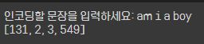
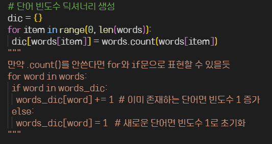
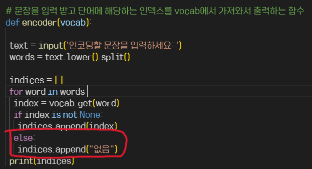
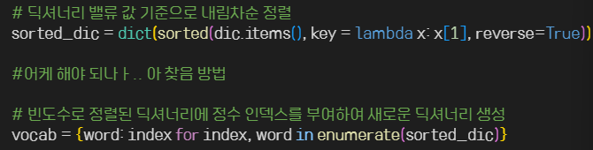

# AIFFEL Campus Online Code Peer Review Templete
- 코더 : 신상호
- 리뷰어 : 김승기


# PRT(Peer Review Template)
- [ ]  **1. 주어진 문제를 해결하는 완성된 코드가 제출되었나요?**
    - 내용 모두 조건에 부합하며 결과물 또한 동일하게 나왔습니다.
    
    

- [ ]  **2. 전체 코드에서 가장 핵심적이거나 가장 복잡하고 이해하기 어려운 부분에 작성된 
주석 또는 doc string을 보고 해당 코드가 잘 이해되었나요?**
    - 조건 중 하나인 단어의 빈도수를 측정하여 딕셔너리로 만드는 부분입니다.
    - 해당 코드의 다른 표현이 작성되어있어 코드 해석에 도움이 됩니다.
    
    - 입력한 문장에 인덱스가 없는 단어가 포함되어있을 경우의
       예외를 처리하는 코드가 들어가 있습니다.
    
      
        
- [ ]  **3. 에러가 난 부분을 디버깅하여 문제를 해결한 기록을 남겼거나
새로운 시도 또는 추가 실험을 수행해봤나요?**
    - 에러를 기록한 내용은 없지만 고민의 흔적이 보입니다.
    - 딕셔너리 컴프리헨션을 사용하여 보다 간결하게 코드를 작성했습니다.
    
        
        
- [ ]  **4. 회고를 잘 작성했나요?**
    - 기존에 학습한 내용을 활용하였고 
      특정부분에서 어려움이 있었다는 내용의 회고가 잘 작성되어있습니다.
     

        
- [ ]  **5. 코드가 간결하고 효율적인가요?**
    - 정확하게 주어진 기능을 수행하는 코드라고 생각합니다.
       


# 회고(참고 링크 및 코드 개선)
```
# 전체적으로 잘 작성된 코드입니다
# 이전에 배운 내용인 컴프리헨션과 enumerate함수를 사용하여 손쉽게 딕셔너리에 인덱스를 부여하고
# 혹시 모를 입력할 문장에서 정렬된 딕셔너리에 없는 단어가 포함되어 있을 경우를 생각하여
# 예외처리까지 수행할 수 있도록 한 것이 인상적이었습니다.

```
