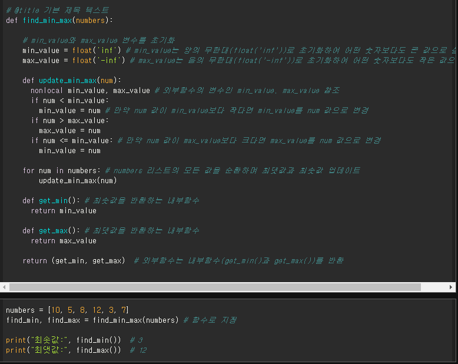
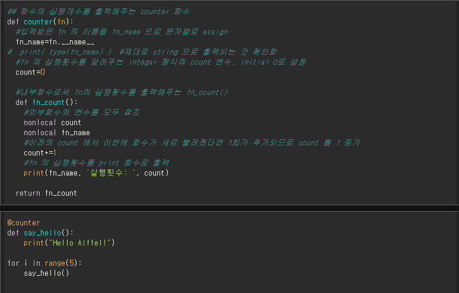
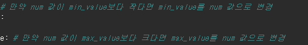
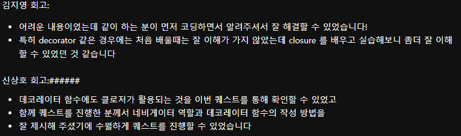
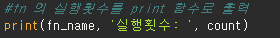

# AIFFEL Campus Online Code Peer Review Templete
- 코더 : 신상호
- 리뷰어 : 조정민


# PRT(Peer Review Template)
- [O]  **1. 주어진 문제를 해결하는 완성된 코드가 제출되었나요?**
    
    
    주어진 조건에 알맞게 코드가 제출되었습니다.

- [O]  **2. 전체 코드에서 가장 핵심적이거나 가장 복잡하고 이해하기 어려운 부분에 작성된 
주석 또는 doc string을 보고 해당 코드가 잘 이해되었나요?**
    
    
    문제1번에서 if num <= min_value: 부분은 없어도 코드에 큰 영향은 안미치지 않을까 생각합니다.
    문제 2번에서 fn_count()의 존재 이유에 대해 자세히 설명되어있는 부분이 인상깊었습니다.
         
- [X]  **3. 에러가 난 부분을 디버깅하여 문제를 해결한 기록을 남겼거나
새로운 시도 또는 추가 실험을 수행해봤나요?**
    제 머릿속으로 디버깅해봤을 때 정상적인 결과가 도출될거라 생각하지만 그럼에도 실행 결과가 포함되어있었으면 좋지 않았을까 생각합니다 .
    
- [O]  **4. 회고를 잘 작성했나요?**
    
    서로 협력하면서 부족한 점을 배워나간 부분을 회고로 작성한 것에 인상깊었습니다.
    
- [O]  **5. 코드가 간결하고 효율적인가요?**
    
    개인적으로 출력 부분을 간단명료하게 코딩하셔서 가독성이 좋다고 생각했습니다.

# 회고(참고 링크 및 코드 개선)
```
문제 2번에서 say_hello()의 이름을 따로 저장하는 fn_name 변수를 만들어 내부함수로 호출해 출력하는 부분이
저희 팀과 차이가 있어 그 부분을 비교해보며 리뷰를 진행하다보니 "이렇게 코딩할 수 있었겠구나" 라는 생각이 들게 해서 좋았습니다 :) 
```
